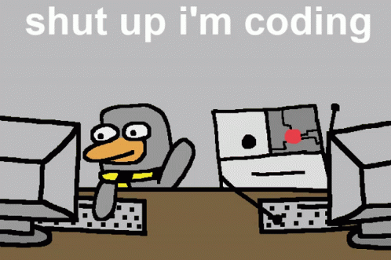

<h1 align="center">Hi there 👋, I'm Nghia</h1>
<h3 align="center">Fullstack Developer from Vietnam</h3>

  

---

### About Me

- 🔭 I'm a **Fullstack Developer** — building everything from UI to server and database
- 🌱 Currently working with **React, WordPress, Node.js, Laravel, MySQL**
- 💡 Passionate about clean code, RESTful APIs, and scalable web applications
- 📫 Reach me at: **[trnghia823@gmail.com](mailto:trnghia823@gmail.com)**
- 🌐 Facebook: [nghia.ngyuen.18](https://www.facebook.com/nghia.ngyuen.18/)

---

### Skill stack

  

---

### GitHub Stats

  

  

