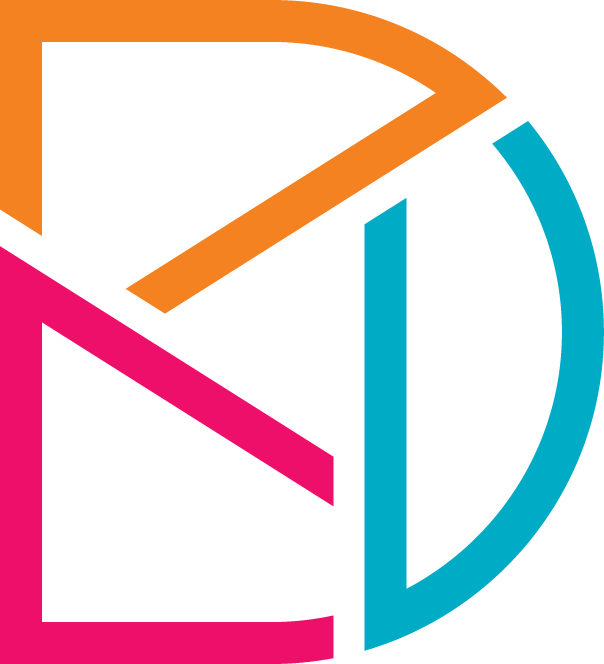
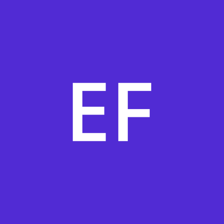
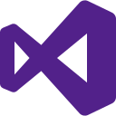
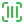

  

  <h1>Trong Nghia</h1>
  
Industrial Systems & Fullstack Software Engineer &bull; Ho Chi Minh City, Vietnam

  

    <a href="mailto:trnghia823@gmail.com"><code>trnghia823@gmail.com</code></a> &bull;
    <a href="https://www.facebook.com/nghia.ngyuen.18/"><code>Facebook</code></a> &bull;
    <a href="https://github.com/tn823"><code>GitHub</code></a>
  

  

    
  

---

### About

I engineer mission-critical industrial software, enterprise data pipelines, and responsive web platforms. My work centers on **hardware communication (RS232/RFID)**, **dual-tier enterprise databases (Oracle MES & HRMS)**, and **applied edge AI (offline Whisper speech telemetry)**.

Unlike consumer web apps, the systems I build run directly on active factory floors—where communication drops or software freezes translate into immediate physical manufacturing stoppages.

---

### Core Competencies

<table>
  <thead>
    <tr>
      <th width="28%">Domain</th>
      <th>Technologies & Capabilities</th>
    </tr>
  </thead>
  <tbody>
    <tr>
      <td><strong>Industrial & Enterprise .NET</strong></td>
      <td>
        &nbsp;
        &nbsp;
        &nbsp;
        &nbsp;
        &nbsp;
        &nbsp;
        
         
        C#, .NET 10 x64, WinForms, ASP.NET Core, Clean Architecture / DDD, Dapper, Entity Framework Core
      </td>
    </tr>
    <tr>
      <td><strong>Hardware & Edge IO</strong></td>
      <td>
        &nbsp;
        &nbsp;
        &nbsp;
        &nbsp;
        
         
        RS232 / COM serial communication, digital weight scale indicators, Zebra RFID FX Series Host SDK, industrial barcode printing
      </td>
    </tr>
    <tr>
      <td><strong>Databases & Analytics</strong></td>
      <td>
        &nbsp;
        &nbsp;
        &nbsp;
        &nbsp;
        
         
        Oracle Database (11g/19c/21c), PL/SQL, Power BI (Star Schema, DAX, KPI modeling), MySQL, PostgreSQL, MongoDB
      </td>
    </tr>
    <tr>
      <td><strong>Applied Edge AI</strong></td>
      <td>
        &nbsp;
        
         
        OpenAI Whisper offline runtime (Whisper.net) for noise-resilient voice command telemetry in shop-floor environments
      </td>
    </tr>
    <tr>
      <td><strong>Fullstack Web & Tools</strong></td>
      <td>
        &nbsp;
        &nbsp;
        &nbsp;
        &nbsp;
        &nbsp;
        &nbsp;
        &nbsp;
        &nbsp;
        &nbsp;
        
         
        TypeScript, React, Next.js, Tailwind CSS, Node.js, Express, Laravel, Docker, Git
      </td>
    </tr>
  </tbody>
</table>

---

### Selected Engineering Work

#### [HWMS — Hazardous Waste Management & Weighing Station Platform](https://github.com/tn823/HWMS)
` .NET 10 x64 WinForms ` &bull; ` Dual Oracle MES + HRMS ` &bull; ` RS232 Serial IO ` &bull; ` Clean DDD ` &bull; ` 16/16 Unit Tests `

* Mission-critical desktop client capturing real-time weight telemetry from digital scale indicators over RS232 serial ports with sub-millisecond latency.
* Synchronizes weighing transactions into `Oracle MES` while simultaneously verifying staff identity and permissions against `Oracle HRMS` in real time.
* Engineered a custom `SerialPortManager` featuring automated heartbeat detection, baud-rate discovery, and hot-reconnect upon cable disconnection.
* Packaged via Single-File ReadyToRun (R2R) ahead-of-time compilation into a single portable binary (~45MB) with &lt;0.8s cold launch time.

#### [NETTMC — Manufacturing Execution & Telemetry System (MES)](https://github.com/tn823/NETTMC2026)
` C# .NET ` &bull; ` Oracle ODP.NET ` &bull; ` OpenAI Whisper.net ` &bull; ` Industrial Line Telemetry `

* Shop-floor telemetry and error tracking system for manufacturing lines, synchronizing status codes and machine events directly to Oracle MES.
* Integrated embedded local speech recognition via **Whisper.net** to allow line operators to log production events and error codes hands-free in high-noise environments.

#### Enterprise Power BI Analytics & Reporting
` Power BI Desktop & Service ` &bull; ` Star Schema ` &bull; ` Advanced DAX ` &bull; ` Oracle & SQL Sources `

* Engineered multi-table Star Schema data models consolidating high-volume factory transaction logs and inventory movements into high-performance analytical datasets.
* Authored complex DAX measures for scrap rate tracking, OEE (Overall Equipment Effectiveness), and shift-level yield analytics.

#### [FnB Management Platform](https://github.com/tn823) & [Time Tracker App](https://github.com/tn823/time-tracker-app)
` React ` &bull; ` TypeScript ` &bull; ` Node.js / Express ` &bull; ` REST API `

* Decoupled 3-tier F&B suite featuring customer ordering UI, administrative dashboard, and scalable REST API backend with JWT authentication.
* Productivity management tool built with TypeScript and modern state management for real-time task analytics.

---

### GitHub Activity

  <table border="0">
    <tr>
      <td align="center">
        
      </td>
      <td align="center">
        
      </td>
    </tr>
  </table>

---

  
Trong Nghia &bull; <a href="https://github.com/tn823">github.com/tn823</a>

